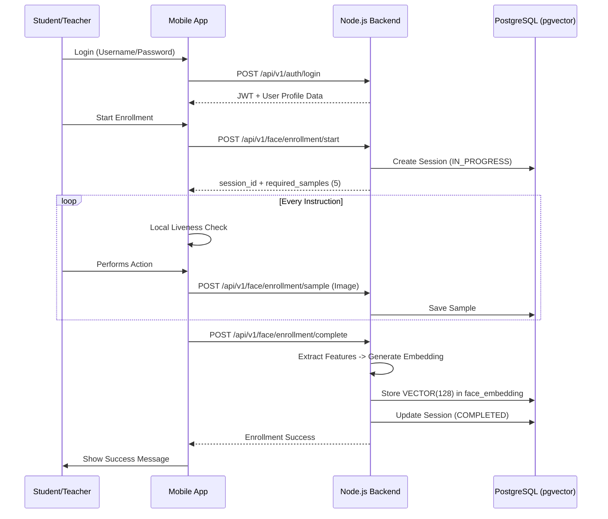
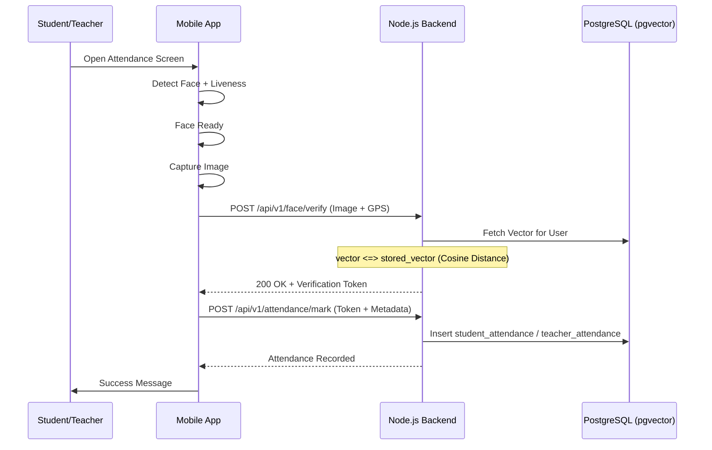

# Face Attendance System Workflow

This document outlines the core operational workflows of the Academic Face Attendance System, detailing the interaction between the mobile client (Flutter) and the backend (Node.js/PostgreSQL).

## 1. Biometric Enrollment Workflow
The enrollment process establishes the student's or teacher's facial identity within the system using 128-dimensional embedding vectors stored in `pgvector`.

---

## 2. Attendance Verification Workflow
The daily attendance process verifies the user's live face against the stored vector using cosine similarity.

---

## 3. Role-Based Access Control (RBAC)

| Role | Access Level |
| :--- | :--- |
| **Directorate Admin** | System-wide view, reports, and global settings. |
| **Principal** | Institution-level management, faculty approval, and reports. |
| **Teacher** | Mark/verify student attendance, view classroom reports. |
| **Student** | View own attendance and enrollment status. |
