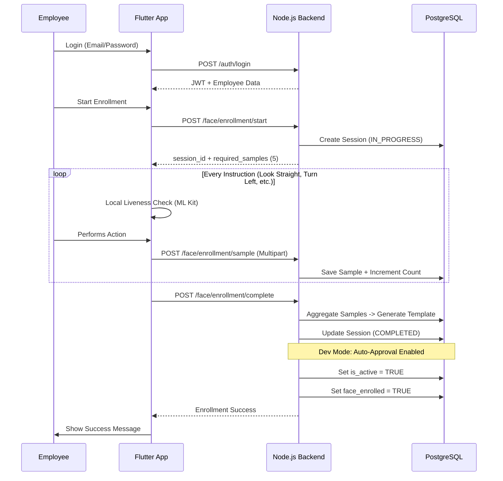
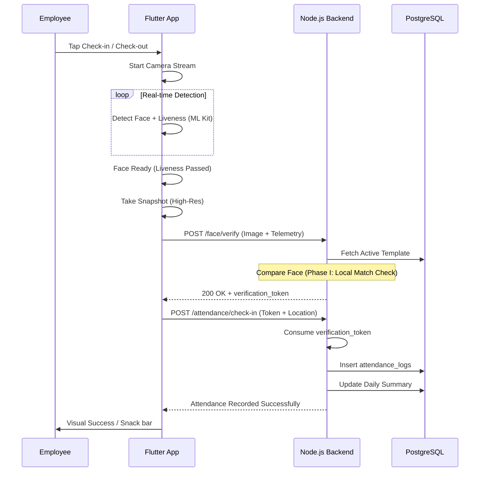

# Face Attendance System Workflow

This document outlines the core operational workflows of the Face Attendance System, detailing the interaction between the Flutter mobile client and the Node.js/PostgreSQL backend.

## 1. Biometric Enrollment Workflow
The enrollment process establishes the user's facial identity within the system.

---

## 2. Attendance Verification Workflow
The check-in/out process verifies the user's identity against the enrolled template.

---

## 3. Error Recovery Logic
How the system handles common failures.

| Scenario | System Behavior | Recovery Action |
| :--- | :--- | :--- |
| **No Session ID** | Scanner blocked | Error shown with **Retry Initialization** button |
| **Verification Failed** | Scanner paused | Error shown with **Retry Scan** button |
| **Not Enrolled** | API returns 400 | User prompted to go to Enrollment screen |
| **Network Loss** | Offline detection | (Phase II) Cache logs for background sync |
